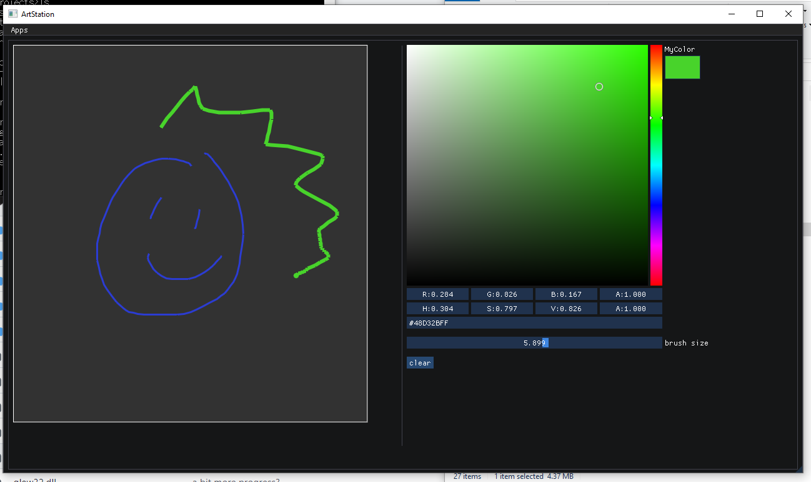
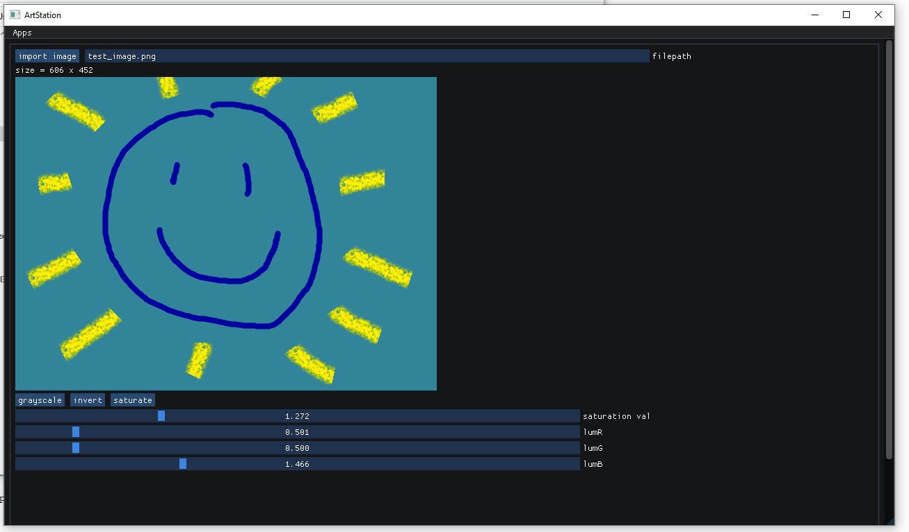
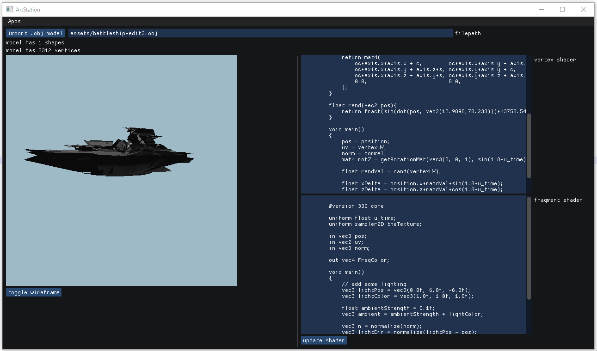
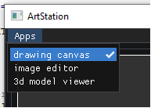

# artStation - a multimedia thingy using Dear ImGUI, SDL2 and OpenGL 3    
just trying out Dear ImGUI and OpenGL for a bunch of small apps like a drawing canvas, image editor, and more!    
    
drawing canvas:    
    
has adjustable brush width    
	
image editor:   
    
has some filters and export image functionality (as .bmp only though currently)    
    
3d model viewer:    
    
with a trackball! just click and drag to rotate around the object (and zoom in/out with the mouse clickwheel)    
    
app option menu:    
    
    
## dependencies:    
- [Dear ImGUI](https://github.com/ocornut/imgui)    
- [SDL2](https://www.libsdl.org/download-2.0.php)    
- [stb_image.h](https://github.com/nothings/stb/blob/master/stb_image.h) and [stb_image_write.h](https://github.com/nothings/stb/blob/master/stb_image_write.h)   
- [tiny_object_loader.h](https://github.com/tinyobjloader/tinyobjloader)
- [GLEW](http://glew.sourceforge.net/install.html) for OpenGL    
- [GLM](https://github.com/g-truc/glm)    
    
## installation:    
I'm using MinGW and MSYS for running `make` in a Windows 10 environment.    
    
For the SDL2 dependency, I downloaded the development library version.    
	
For the GLEW dependency, I downloaded the precompiled binaries and followed the "Using GLEW as a shared library" route noted [here](http://glew.sourceforge.net/install.html). If using MinGW (I'm using `v6.3.0` btw), you should put `glew32.lib` in `MinGW/lib`.
	
For the GLM library dependency, I just `git clone`'d its GitHub repo.    
    
Note that the header file dependencies I'm using (stb_image, stb_image_write, tiny_object_loader) are in `/external`.
    
Once in this directory, update `Makefile` so that the directory paths for SDL2 and GLEW match the paths for their location on your computer. Then run `make`.    
    
Don't forget that `SDL2.dll` and `glew32.dll` are needed in the same directory of the `.exe` application in order for it to run (they are included in this repo).    