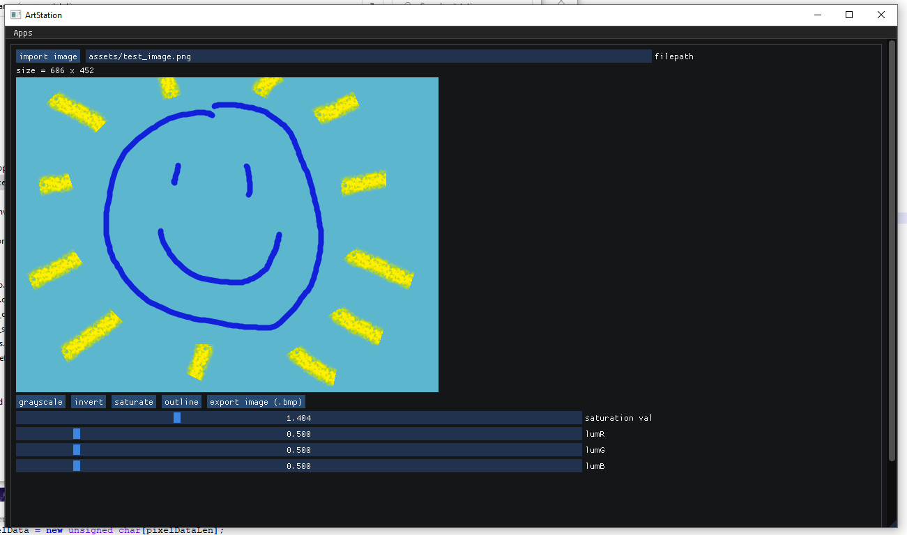

# artstation - a multimedia thingy using Dear ImGUI, SDL2 and OpenGL 3 (WIP)    
just trying out Dear ImGUI and OpenGL for a bunch of small apps like a drawing canvas, image editor, and more!    
there's not much to see at the moment though.    
    
drawing canvas:    

    	
image editor:   
    
    
3d model viewer:    
    
    
## dependencies:    
- [Dear ImGUI](https://github.com/ocornut/imgui)    
- [SDL2](https://www.libsdl.org/download-2.0.php) (the development library)    
- OpenGL 3 (came with MinGW v6.3.0 in `MinGW/include/GL`)    
- [stb_image.h](https://github.com/nothings/stb/blob/master/stb_image.h)   
- [tiny_object_loader.h](https://github.com/tinyobjloader/tinyobjloader)
- [GLEW](http://glew.sourceforge.net/install.html)   
    
## installation:    
If using Windows, you just need MinGW (should include the core OpenGL dependency needed for Dear ImGUI to work), MSYS for running `make` and SDL2.    
    
For the GLEW dependency, I downloaded the precompiled binaries and followed the "Using GLEW as a shared library" route noted [here](http://glew.sourceforge.net/install.html). If using MinGW (I'm still using `v6.3.0` btw), you should put `glew32.lib` in `MinGW/lib`.
	
Once in this directory, update `Makefile` so that the directory paths for SDL2 and GLEW match the paths for their location on your computer. Then run `make`.    
    