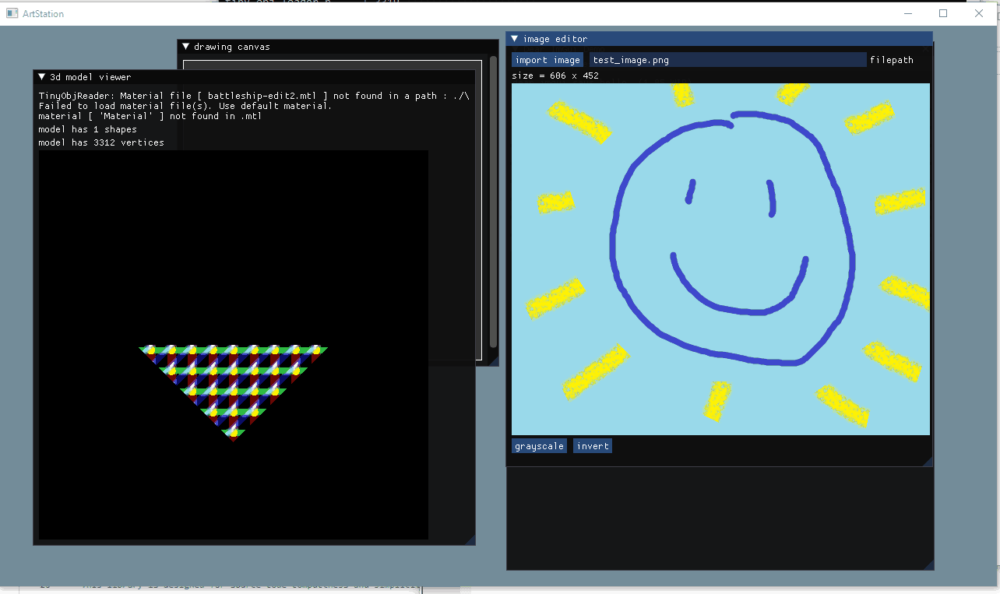

# multimedia thingy using Dear ImGUI, SDL2 and OpenGL (WIP)    
just trying out Dear ImGUI and OpenGL for a bunch of small apps like a drawing canvas, image editor, and more!    
    

	
## dependencies:    
- SDL2    
- OpenGL3    
- [stb_image.h](https://github.com/nothings/stb/blob/master/stb_image.h)   
- [tiny_object_loader.h](https://github.com/tinyobjloader/tinyobjloader)
- a couple more to come probably (for 3d stuff)    
    
## installation:    
If using Windows, you just need MinGW (should include the core OpenGL dependency needed for Dear ImGUI to work), MSYS for running `make` and SDL2.    
Once in this directory, update `Makefile` so that the directory paths for SDL2 and OpenGL match the paths on your computer. Then run `make`.    
    